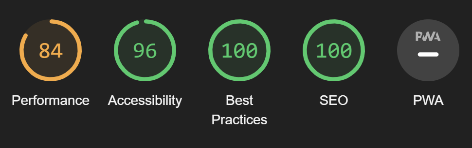

# Discoe Music Festival

The purpose of this page is to inform potential customers about a music festival happening in Glencoe

## Features

### Existing Features

### Features Left to Implement

## Testing

### Validator Testing

- HTML
    - No errors were returned when passing through the official [W3C validator](https://validator.w3.org/).

- CSS
    - No errors were found when passing through the official [(Jigsaw) validator](https://jigsaw.w3.org/css-validator/)

### Compatibility Testing

Site was tested across multiple virtual devices through chrome developor tools.

Site was tested to work on Google chrome, firefox, microsoft edge and internet explorer, although hero image animation does not play on internet explorer.

### Performance Testing

I generated lighthouse reports for each page of the website, mainly looking to achieve a high accessibility score.

Landing Page: 

Line-up and Tickets Page:

Mailing List Page:

Gallery Page: 

### Unfixed Bugs

There are currently no known bugs in the website.

## Deployment

- The site was deployed to GitHub pages. The steps to deploy are as follows
    - In the Github repository, navigate to the Settings tab
    - From the source section drop-down menu, select the Master Branch
    - Once the master branch has been selected, the page will be automatically refreshed with a detailed ribbon display to indicate the successful deployment.

The live link can be found here - https://ryandteague.github.io/DisCoe/index.html    

## Credits

